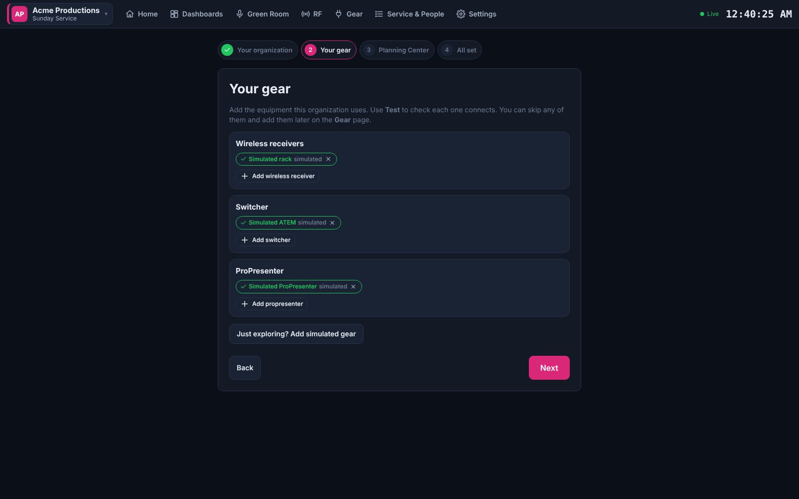
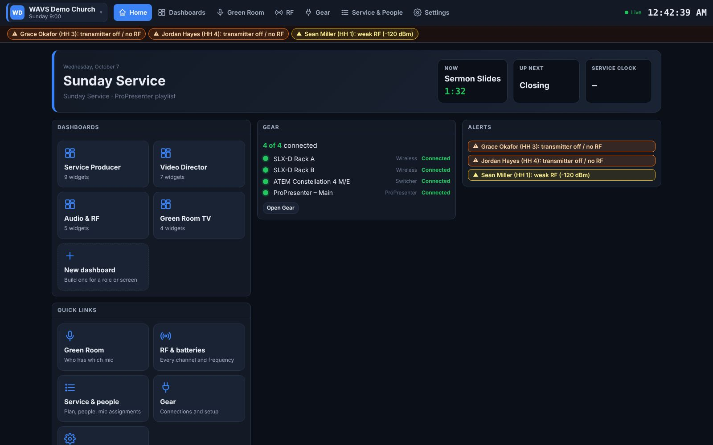
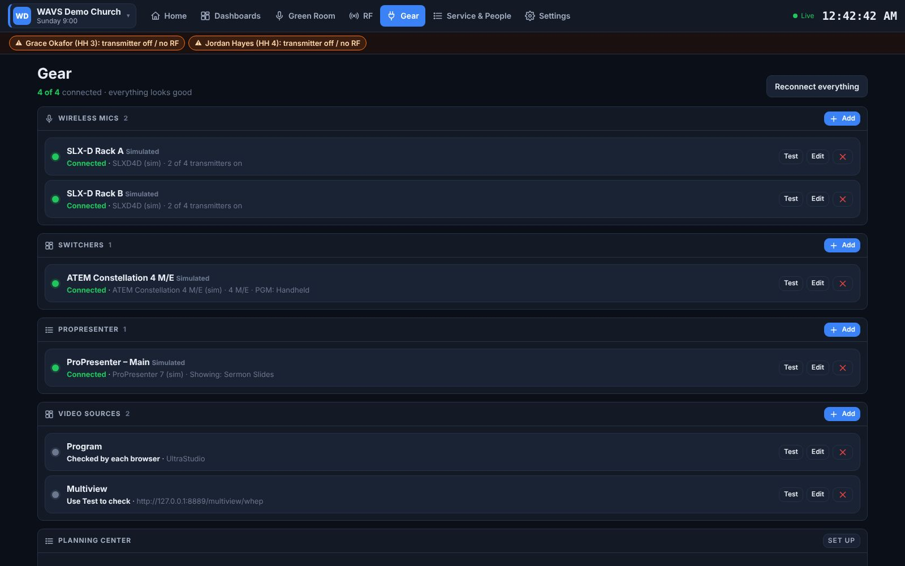
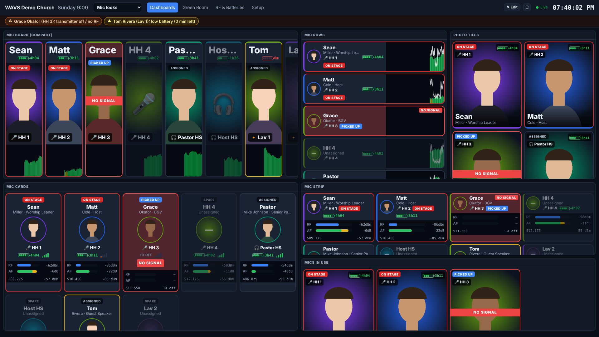

# WAVS Dashboard

A self-hosted production dashboard for live events and church services. It runs on one
computer in the booth, and any browser on the network can open it: FOH, broadcast, the
green room tablet, a TV in the hallway, or a phone.

You build **your own dashboards**: one per role or screen, made of widgets you drag and resize.
The widgets include video feeds, ProPresenter, ATEM tally, the Planning Center service plan,
wireless mics with photos, RF, notes and checklists.


| | |
|---|---|
|  |  |
|  |  |

<sub>Screenshots taken with `npm run demo`, using simulated devices and placeholder photos.</sub>

## Quick start

```bash
npm install
npm run demo          # every device simulated, no hardware needed
# open http://localhost:8080
```

To use your own gear, run `npm start` and open http://localhost:8080. A short **setup wizard**
asks for your organization's name and colour, your gear (each item with a **Test** button) and,
optionally, Planning Center. Everything can be changed later on the **Gear** and **Settings** pages.
You don't need to edit a config file.



## Pages

| URL | What it is |
|---|---|
| `/` | **Home**: what's on now and up next, the service clock, your dashboards, gear health and alerts. |
| `/dashboards` or `/d/<name>` | **Dashboards.** Pick one from the drop-down in the header. Each screen remembers the last one it showed. |
| `/greenroom` | The **mic board**: one tall column per mic with the person's name, photo, battery and a live RF/audio graph, plus **Picked up / On stage / Returned** buttons (`?handoff=1` keeps them on, `?view=cards` for the older card view). |
| `/rf` | Every receiver channel, plus a frequency plot that flags carriers spaced too closely. |
| `/admin` | **Service & People**: the order of service (Planning Center, the ProPresenter playlist, or typed in), people and photos, mic assignments. |
| `/gear` | **Gear**: shows whether each receiver, switcher, ProPresenter and Planning Center is connected. Add, edit, **Test** and remove devices here. |
| `/settings` | **Settings**: name, colour, logo, admin PIN, Planning Center, alert thresholds, organizations. |
| `/comms/control` | **Comms**: the team list, who can talk and listen on each channel, cues, and the QR code phones scan to join. |
| `/comms/engine` | The **comms engine**, which mixes the comms audio. Open it on the dashboard computer and leave it open. |
| `https://<ip>:8443/comms` | **Comms on a phone**: sign in, then listen and talk. |



## Organizations (company and church)

If the same dashboard serves more than one organization, such as your production company at
events and your church on Sundays, add each as an **organization**. Each one has its own:
- gear (receivers, switchers, ProPresenter, video sources)
- people, photos and mic assignments
- dashboards, notes and checklists
- service plans and Planning Center account
- name, colour, logo and admin PIN

The active organization is always shown at the top left, in its colour. Click it to **switch**
or **add** an organization. Switching changes every connected screen at once, and a new
organization starts in the setup wizard. Only one organization is active at a time, because it
controls the gear.

## Gear page



Every device shows a green or red dot with what it reports, for example
"Connected · SLXD4D · firmware 2.4 · 3 of 4 transmitters on", or the reason it isn't connected.
**Test** checks a device without saving anything, and gives plain-language results such as
"Connection refused: the device is there but not accepting connections on that port".
Choosing a Shure model fills in the right number of channels.

Add `?kiosk=1` to any URL to hide the header on TVs and confidence monitors. The ⛶ button does
the same.

## Building dashboards

Four starter dashboards are created on first run: **Service Producer**, **Video Director**,
**Audio & RF** and **Green Room TV**. To change one, or make your own:

1. Click **✎ Edit**. The widget panel opens on the left.
2. Click a widget to add it, drag it by its title bar, and resize it from the corner.
3. Use ⚙ for a widget's settings: which video source, switcher and M/E, which mics, which
   checklist, and so on. ✕ removes it.
4. **Rows** sets how many rows fit on one screen without scrolling. Use fewer rows for big TVs
   and more for desktops.
5. **Save**. Every screen showing that dashboard updates straight away.

**New** and **Duplicate** create dashboards for other roles, such as Camera Ops, Lighting,
Lobby TV or Campus 2. On phones, widgets stack into a single column.

### Widgets

| Category | Widgets |
|---|---|
| Service | **Service plan** (planned start times, current item countdown, actual vs planned), **Current item** (big countdown and up next), **Service clock** (countdown to start, time remaining, overrun), **Clock** |
| Video | **Video feed** (capture card, WebRTC/WHEP, HLS, MJPEG, web page) with PGM/PVW tally overlay |
| Switcher | **Program / Preview** for any M/E, **Switcher overview** (every M/E with keyers, DSKs, aux outputs, stream/record), **Camera tally** (red on air, green preview, per M/E or all) |
| Slides | **ProPresenter** (live and next slide, groups, layers, screens, look, recording), **ProPresenter timers**, **Stage message** |
| Audio & RF | **Mics & gear** in five looks (see below), **RF & batteries** table, **Frequency plot** |
| Team | **Alerts**, **Notes** (shared live), **Checklist** (shared live, with sections and progress), **Text**, **Web page** (stream analytics, Resi, encoder status, Companion…) |

### Mic board
The **Green Room TV** dashboard and `/greenroom` show one column per mic:
- **Who:** the person's first name in large type, then their surname and role, with their photo
  on a coloured glow. You can pick each person's colour on the Service & People page (🎨 next to their photo),
  otherwise one is picked automatically.
- **Which mic:** the mic label and its status (Assigned, Picked up, On stage).
- **Health:** battery in the corner, plus a rolling graph across the bottom. The bars are RF
  signal (green, or amber when weak) and the white line is audio, so you can see who's talking.
- **Problems:** the whole column turns red and pulses if a mic in use loses signal or its receiver
  goes offline.

Cut-out photos (PNG with a transparent background) look best, because the colour shows around them.

### Mics & gear: pick a look per dashboard
The Add widget panel offers ready-made versions:

| Version | Good for |
|---|---|
| Mic board (full screen) | Green room TV: tall photo columns with a rolling RF/audio graph |
| Mic board (compact) | Half a screen: no role or numbers, 20-second RF graph |
| Mic rows (side panel) | A narrow column beside video or the plan: one line per mic with a graph |
| Mic cards | Round photo, battery, RF strength and live meters |
| Photo tiles | Photo-first grid with the name over the picture |
| Mic strip (bottom bar) | A thin row along the bottom of a production dashboard |
| Mics in use | Only people who've picked up a mic or are on stage, on-stage first |



Every version can be changed afterwards with ⚙:
- **Layout:** look, number of columns, whether photos are cropped to fill or shown whole (best for cut-outs).
- **Filter & order:** all mics, assigned only, or in use only; certain mic types (handhelds, headsets, lavs…) or specific mics; rack order, on-stage first, or by name.
- **Show:** photo, surname and role, mic label, hand-off status, battery, frequency and signal numbers, hand-off buttons.
- **Signal:** a rolling graph (RF and audio, RF only or audio only; 20, 40 or 60 seconds), live meter bars, or nothing; and whether a mic in use that loses signal flashes red.

Every widget also has **Hide the title bar** and **Content size** (75–150%), so you can fit more on a
small screen or make a TV readable from across the room.

Notes and checklists are shared by name. Two widgets set to the same name, even on different
dashboards, show and edit the same note.

## Service plan and auto-tracking

### Planning Center Services
1. Create a **Personal Access Token** at
   <https://api.planningcenteronline.com/oauth/applications>.
2. Paste the Application ID and Secret into **Settings → Planning Center**, press **Test**, and
   tick the service types to follow.
3. The next upcoming plan loads automatically. The **Service & People** page lists upcoming
   plans across your service types so you can switch.

The plan gives you items (songs with keys, headers, lengths), service times, and the current item.

### ProPresenter playlist as the order of service
No Planning Center? On **Service & People**, press **Use the ProPresenter playlist**. The playlist
that's active in ProPresenter becomes the order of service, headers included, and it advances as
the operator cues each item.

### Which item is "current"
Whichever of these happens most recently moves the plan along:
- **ProPresenter playlist**: when the operator cues the next item in the active playlist, the plan
  moves to the matching item:
  - by name first, so "Holy Forever" matches "Holy Forever (Live)"
  - by position if the names differ but the playlist and plan have the same number of items
- **ProPresenter presentation**: a presentation started from the library, outside the playlist,
  is matched by name.
- **Planning Center Services LIVE**: if someone is advancing LIVE, the dashboard follows it.
- **Manual**: tap an item in the Service plan widget, or use ◀ ▶.

So running ProPresenter as usual keeps everyone on the same page. Turn this off in
**Settings → Alerts & automation**.
- **Planning Center Services LIVE**: if someone is advancing LIVE, the dashboard follows it.
- **Manual**: tap an item in the Service plan widget, or use ◀ ▶.

When an item ends, the time it actually took is recorded, so the plan shows actual against
planned (red if it ran long). That's your "how did Sunday go".

### Faith Teams and other sources
Faith Teams' public API covers people and giving, but not service plans. Until it does, use
**Use the ProPresenter playlist** or **Type or paste a plan** on the Service & People page:

```
# Worship
song 4:30 Goodness Of God
song 5:00 Holy Forever
# Message
0:30 Bumper
35m Message
```

Set a start time to get planned item times and the service clock. Everything else, including
ProPresenter auto-tracking, works the same as with Planning Center.

## Hardware

### Shure SLX-D (also ULX-D, QLX-D, Axient Digital)
Connects to each receiver's control port (TCP 2202). The product family is detected from the
receiver, or you can set `model: SLXD4D`. For SLX-D it reads:
- channel name, frequency and group/channel
- transmitter model (SLXD1/SLXD2), and whether the transmitter is on
- battery bars and runtime in minutes (`TX_BATT_BARS`, `TX_BATT_MINS`)
- live RF level and audio peak/RMS meters (on SLX-D's 0–120 scale)

With `control.pushNamesToReceivers: true`, assigning a person writes their first name to the
receiver's display.

> Receivers allow a limited number of control connections, and Wireless Workbench uses them too.
> If one won't connect, close other control software.

### Blackmagic ATEM, including Constellation 4 M/E
Uses `atem-connection`, which installs automatically. It reports every M/E (program, preview,
transition, fade to black, upstream keyers), the downstream keyers, every aux output, camera input
names, and streaming/recording state. Use `meNames` and `auxNames` in the config for friendly
labels, and `me:` for the default M/E. Each widget can pick its own M/E.

vMix is supported through its HTTP API.

### ProPresenter 7 (7.9 or newer)
In ProPresenter, go to **Settings → Network → Enable Network** and put the port in the config.
More than one machine is supported. Sending stage messages from the dashboard is optional
(`control.propresenterStageMessage`).

### Video feeds
A web page can't read SDI or NDI directly. Each source in `video.sources` uses one of these types:

| Type | Use when | Notes |
|---|---|---|
| `capture` | A capture card (UltraStudio, DeckLink, Magewell, Cam Link…) is connected to the computer showing the dashboard | Lowest latency. Only works on `http://localhost` or HTTPS. Hover over the tile to pick a device. |
| `webrtc` | You want feeds on any screen in the building | Run [MediaMTX](https://github.com/bluenviron/mediamtx) and send it SRT or RTMP from the ATEM or an encoder (or NDI through a bridge). URL: `http://<mediamtx>:8889/<path>/whep`. About 0.5 s latency. |
| `hls` | Latency doesn't matter | Any `.m3u8` URL |
| `mjpeg` | A camera or encoder serves MJPEG or JPEG snapshots | Add `refreshMs` for snapshot URLs |
| `iframe` | Any web page | |

## Comms (intercom on phones)

Your crew talk and listen through their phone's browser. Nothing needs installing.

**Channels.** Directors, Cam Ops, Lighting, GFX, Audio and Stage come set up. Rename, recolour, add or remove them on the Comms page. Each person has a **T** (talk) and **L** (listen) switch per channel. Phones have a volume slider and a listen switch per channel. **Hold TALK** to talk, or **tap it once** to latch it on and tap again to stop.

**Positions.** Positions (Director, Camera op, GFX / ProPresenter, ...) set the channels a person starts with. Change the defaults under *Position defaults*. Changing someone's position resets their channels to that position's defaults.

**Add your team before the event.** On `/comms/control`, under *People*, type each person's name and pick their position. You can also give them:
- a **personal code**, so nobody else can sign in as them
- the **Lead** role. Leads see a *Control* button on their phone. They can manage channels, people and cues, but they can't change sign-in rules or choose leads.

On site, people scan the QR code, type their name (and their code), and arrive in the right channels. Names don't care about capitals or extra spaces.

**Sign-in rules** (producer only):
- **Only people on the list can sign in** stops walk-ins.
- A **team password** is one password everyone types, for example from the call sheet.

With both off, anyone on the network can join and pick a position.

**Cues.** Send Standby, GO or a text message to everyone, to one channel, or to one person. Their phone flashes and vibrates. The Comms page shows who tapped *Got it*.

### Setting it up
1. On the dashboard computer, open **`http://localhost:8080/comms/engine`** in Chrome and click **Start**. Leave the tab open; closing it stops comms. Allow the microphone when asked: that lets phones connect directly, and nothing is recorded.
2. Phones join by scanning the QR code on the Comms page. There are two kinds of link:
   - **Same Wi-Fi** (`https://<computer-ip>:8443/comms`): the phone must be on the same network as the dashboard computer. Phones only allow the microphone on `https://` pages, so the dashboard runs a second, encrypted port (**8443**) with its own certificate (stored in the data folder under `tls/`). The first time, each phone warns that the connection isn't private:
     - iPhone: tap **Show Details → visit this website**.
     - Android: tap **Advanced → Proceed**.

     Change the port with `HTTPS_PORT=...` (`HTTPS_PORT=0` turns it off).
   - **Anywhere** (turn on **Off-site access** on the Comms page): a secure link like `https://<random>.trycloudflare.com/comms` that works on any network (Wi-Fi, a personal hotspot, cellular) with no certificate warning. It uses a free Cloudflare quick tunnel and needs no account. The first time, the dashboard downloads Cloudflare's `cloudflared` program into the data folder (`bin/`); if you already installed it with Homebrew, that copy is used. The link changes each time the dashboard restarts, and the QR code updates with it. Only the comms phone page is reachable through this link: the dashboard, settings and the comms control page are not. Set a **team password** or **Only people on the list** when using it.
3. Use headphones. Each phone keeps its screen awake while comms is open.

**How the audio travels.** A phone first tries to connect its audio directly to the comms engine, which is quickest. If that doesn't work within a few seconds (a hotspot, cellular, or guest Wi-Fi that keeps devices apart), it automatically sends its audio through the dashboard instead. The phone then shows **Connected · via internet**, and the Comms page shows *audio via internet*. That uses about 128 kbit/s each way, and only while someone is talking.

**Phone can't open the link?** The Comms page has a checklist under *Phone can't open it?*:
- Turning on **Off-site access** fixes most cases.
- On the same Wi-Fi, guest networks often block devices from reaching each other.
- The Mac's firewall must allow **node** to accept incoming connections.
- If the computer has several network addresses, try each one in the list. The one marked ✓ is the most likely.

This is built for **15–20 people** on one computer. On the same Wi-Fi, audio goes directly from each phone to the comms engine without going through the internet.

### Behringer WING (or any audio interface)
Connect the WING to the dashboard computer over USB. On the comms engine page, under **Audio interface**:
- **Input from console**: choose the WING, a USB channel and the comms channels it feeds. For example, WING talkback on USB 1 goes into **GFX**.
- **Output to console**: choose the WING, a USB channel and the comms channels it carries. For example, Directors goes to USB 3, which you route to a WING bus.

Chrome sometimes only reads the first 2 input channels of an interface. If so, send the talkback to USB 1 or 2.

## Alerts
These alerts appear on every page, and critical ones play a chime:
- a receiver, ProPresenter or switcher goes offline
- a transmitter is **off or has no RF while its person is marked "On stage"** (critical) or
  "Picked up"
- a battery is low (runtime is used when the transmitter reports it)
- weak RF on a mic in use, RF interference, a muted transmitter on stage, or Fade to Black left on

You can change the thresholds under `alerts:` in the config.

## Tailoring it
- **Branding**: name, colour and logo in **Settings**. All styling is in `public/css/app.css`.
- **Security**: set an **admin PIN** in Settings. It's then required to change gear, settings,
  people and dashboards, and to switch organization. Moving through the plan, notes and
  checklists stay open so the whole team can use them.
- **New widget**: add an entry to `public/js/widgets.js`. Each widget declares its title, settings
  and a `mount()` function, and it then appears in the builder automatically.
- **New hardware**: add a driver in `server/drivers/` that calls `hub.update(section, id, data)`,
  and register it at the top of `server/index.js`. Good candidates: Sennheiser (SSC),
  Allen & Heath and Behringer/Midas consoles, Companion variables, YouTube/Facebook viewer counts.

## Architecture

```
 ProPresenter ──HTTP──┐
 ATEM / vMix ─────────┤                       ┌── /d/<dashboard>  widgets (gridstack)
 Shure RX ──TCP 2202──┼─► Node server ──WS────┼── /greenroom
 Planning Center ─────┤   (hub, alerts,       ├── /rf
 (simulators) ────────┘    service tracker)   └── /admin  (setup)
                          data folder (orgs, people, plans, dashboards, comms)
 Capture card / MediaMTX ──────────────────► browser <video>
```

- `server/`: Express and WebSocket. All live state sits in one hub. Meters are batched and sent
  10 times per second.
- `public/`: plain HTML, CSS and JS modules with no build step.
- **Your data** (everything you create, as plain JSON) is kept outside the code folder, so updating,
  re-downloading or re-cloning the dashboard never loses it:
  - macOS: `~/Library/Application Support/WAVS Dashboard`
  - Windows: `%APPDATA%\WAVS Dashboard`
  - Linux: `~/.wavs-dashboard`

  `orgs.json` lists the organizations, and each one has a folder `orgs/<id>/` with its settings
  (gear, PIN, Planning Center), people and photos, dashboards, notes, plan progress and comms.
  Settings → Organizations shows the exact location. Back this folder up, or copy it to move to
  another computer. Set `WAVS_DATA=<folder>` to use a different folder.

  Older versions kept this in the code folder's `data/`. On first start, the dashboard copies the
  most recently used setup from there, or from another copy named `WAVS-Dashboard…` in your
  home folder, Downloads, Desktop or Documents. The old folder is left untouched.
- `config/config.yaml` is optional and only holds the server port. When this version first
  starts, the gear and branding from an existing `config.yaml` are imported into the first
  organization, along with existing people and dashboards.
- `npm test`: tests for the Shure (SLX-D/ULX-D/AD) and vMix parsers, alert rules, plan parsing,
  ProPresenter auto-tracking, organizations and settings validation.

## Running it permanently

Any Mac, Windows or Linux computer with Node.js 18 or newer will work. To keep it running after
a reboot, use `pm2` (`npm i -g pm2 && pm2 start server/index.js --name wavs && pm2 save && pm2
startup`), or a systemd service, or a launchd agent. Give the computer a fixed IP so the
dashboard URL doesn't change.
