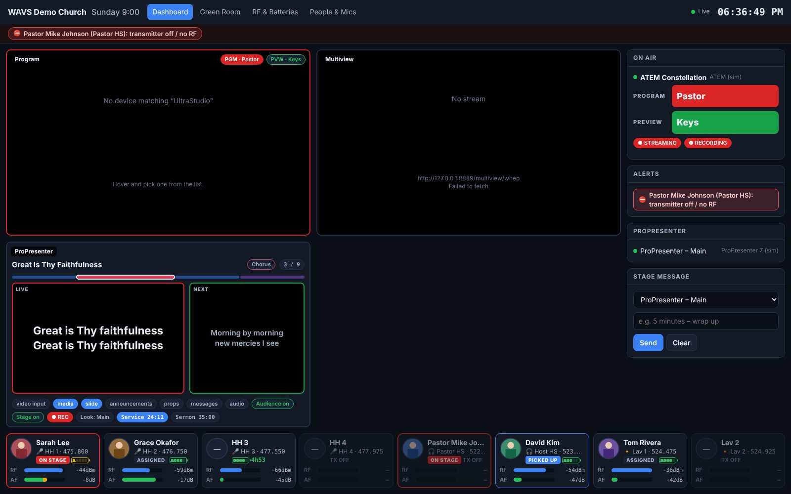
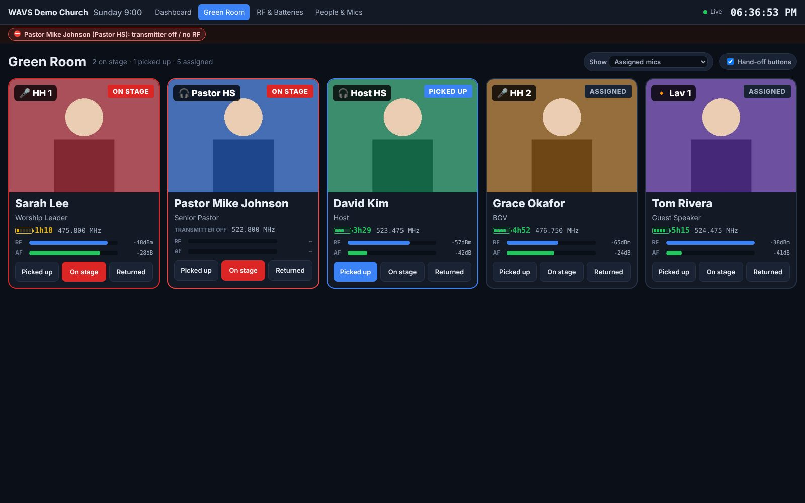
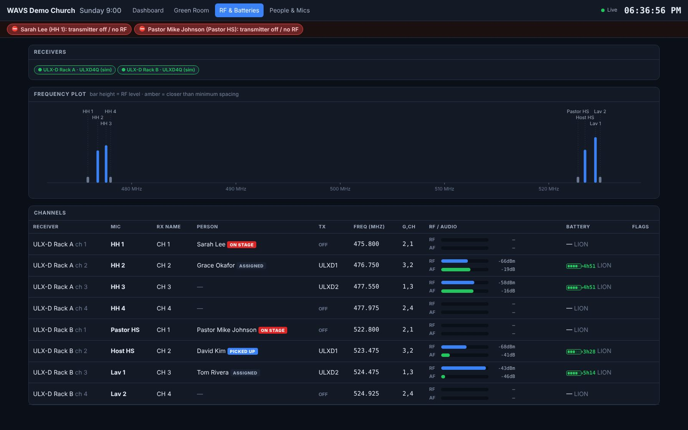
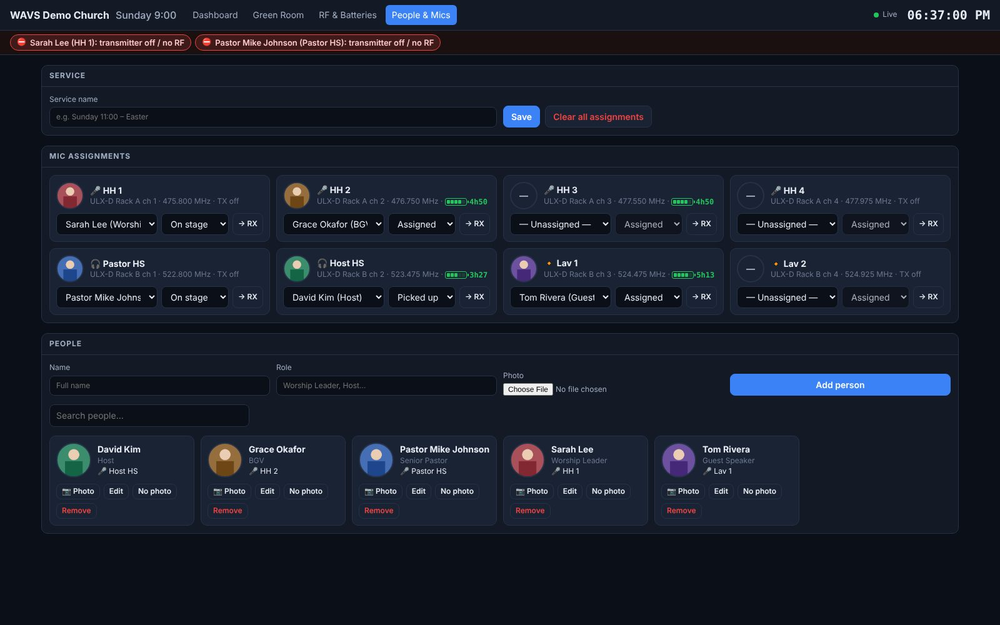

# WAVS Dashboard

A self-hosted production dashboard for live events and church services. It runs on one
computer in the booth, and any browser on the network can open it: FOH, broadcast, the
green room tablet, or a TV in the hallway.

| Page | URL | For |
|---|---|---|
| **Dashboard** | `/` | Program feed and multiviews, ProPresenter live and next slide, switcher tally, alerts, and a mic strip with live RF, audio and battery |
| **Green Room** | `/greenroom` | Large photo cards showing who has which mic, with battery and RF. Volunteers tap **Picked up**, **On stage** or **Returned** |
| **RF & Batteries** | `/rf` | Every receiver channel: frequency, group/channel, RF and audio meters, battery runtime, interference, plus a frequency plot that flags carriers spaced too closely |
| **People & Mics** | `/admin` | Add people with photos, assign them to mics, set the service name, and send names to the receivers |






<sub>Screenshots taken with `npm run demo`, using simulated devices and placeholder photos.</sub>

## Quick start

```bash
npm install
npm run demo          # every device simulated, no hardware needed
# open http://localhost:8080
```

To use your own gear:

```bash
cp config/config.example.yaml config/config.yaml
# edit IPs, mic labels, video tiles…
npm start
```

`npm start` reads `config/config.yaml`. If that file doesn't exist it falls back to the demo
config. Set `WAVS_CONFIG=path/to/file.yaml` to choose another file, so you can keep one config
per venue or campus. Uploaded photos and assignments are saved in `data/`, which is excluded
from git. Back that folder up.

## What it talks to

### ProPresenter 7 (7.9 or newer)
Uses the built-in REST API. In ProPresenter, go to **Settings → Network → Enable Network** and
copy the port into the config. The dashboard shows:
- the presentation name, the current slide group and the slide number
- the live and next slide text, plus a thumbnail of the live slide
- which layers are active (slide, media, video input, props, messages, audio)
- whether the audience and stage screens are on, the active Look, and capture/recording status
- timers, and the current stage message

You can add more than one machine (for example, lyrics and IMAG). If you turn on
`control.propresenterStageMessage`, you can send a stage-display message from the dashboard.

### Switchers (tally)
- **Blackmagic ATEM**: uses `atem-connection`, which installs automatically. Shows program and
  preview source names, fade to black, and streaming/recording state.
- **vMix**: uses the HTTP API on port 8088.

A video tile set to `switcher: <id>` shows `PGM · <source>` on top of the feed.

### Video feeds (program and multiviews)
A web page can't read SDI or NDI directly, so choose the tile type that matches how the feed
reaches the computer:

| Type | Use when | Notes |
|---|---|---|
| `capture` | A capture card (Blackmagic UltraStudio or DeckLink, Magewell, Elgato Cam Link, AJA U-TAP…) is connected to the computer showing the dashboard | Lowest latency. Browsers only allow capture on `http://localhost` or HTTPS. Hover over the tile to pick a device; the choice is remembered. Add `audio: true` to monitor embedded audio |
| `webrtc` | You want feeds on any screen in the building | Run [MediaMTX](https://github.com/bluenviron/mediamtx) and send it SRT or RTMP from the ATEM, your encoder or OBS (or NDI through a bridge). Use the WHEP URL `http://<mediamtx>:8889/<path>/whep`. Latency is about 0.5 s |
| `hls` | Remote viewing where latency doesn't matter | Any `.m3u8` URL |
| `mjpeg` | A camera or encoder that serves MJPEG or JPEG snapshots | Add `refreshMs` for snapshot URLs |
| `iframe` | An encoder status page, a streaming dashboard, and so on | |
| `propresenter` | A live ProPresenter panel shown as a tile | |

Tiles can be `size: 1`, `2` or `wide`. Double-click a tile for full screen.

### Wireless mics (Shure)
Connects to Shure networked receivers over their TCP control protocol (port 2202). It is
written for **ULX-D, QLX-D and SLX-D** and is compatible with **Axient Digital**. It reads:
- the channel name, the transmitter model and whether the transmitter is on
- the frequency and group/channel
- live RF level and antenna diversity, plus a live audio meter
- battery bars, runtime in minutes, charge percentage and battery type
- transmitter mute and RF interference warnings

If `control.pushNamesToReceivers` is on, assigning a person to a mic writes their first name to
the receiver's display.

> Shure receivers support only a limited number of control connections, and Wireless Workbench
> also uses them. If a receiver won't connect, close other control software or check the
> receiver's network settings.

### Alerts
These alerts appear in the banner on every page, and critical ones play a chime:
- a receiver, ProPresenter or switcher goes offline
- a transmitter is **off or has no RF while its person is marked "On stage"** (critical) or
  "Picked up"
- a battery is low. Runtime in minutes is used when the transmitter reports it, otherwise bars
- weak RF on a mic in use, RF interference, a muted transmitter on stage, or Fade to Black left on

You can change the thresholds under `alerts:` in the config.

## Green room flow

1. Before the service, open **People & Mics**. Add people with a photo (on a phone or tablet you
   can take one with the camera) and assign each person a mic.
2. Put **Green Room** on a TV or tablet. On the tablet, use `/greenroom?handoff=1` so the
   **Picked up**, **On stage** and **Returned** buttons are always visible.
3. When someone takes a mic, tap **Picked up**. When they walk on, tap **On stage**. From then on,
   a transmitter that switches off or a battery that runs low raises an alert on every screen.
4. After the service, use **Clear all assignments**. People and their photos are kept for next week.

## Tailoring it

- **Branding**: set `org.name`, `org.logo` and `org.theme` (accent, background and panel colours).
- **Mic labels**: list each receiver's `channels` with a `label`, a `kind`
  (`handheld | lav | headset | iem | instrument`) and an optional `hidden`.
- **Security**: set `security.adminPin` to require a PIN for edits. Viewing never needs a PIN.
- **Look**: all styling is in `public/css/app.css`, with CSS variables at the top.
- **New hardware**: add a driver in `server/drivers/`. A driver is a class with `start()` and
  `stop()` that calls `hub.update(section, id, data)` for state and `hub.meter(micId, {...})` for
  fast meters. Register it in the driver maps at the top of `server/index.js`. Sennheiser
  (EW-DX/SSC), Allen & Heath and Behringer/Midas consoles, Ross, or Companion variables are
  good candidates.

## Architecture

```
 ProPresenter ──HTTP──┐
 ATEM / vMix ─────────┤                    ┌── /            dashboard
 Shure RX ──TCP 2202──┼─► Node server ──WS─┼── /greenroom   green room
 (simulators) ────────┘   (hub + alerts)   ├── /rf          RF & batteries
                      data/greenroom.json  └── /admin       people & mics
 Capture card / MediaMTX ───────────────► browser <video> tiles
```

- `server/`: Express and WebSocket. All live state sits in one hub. Meters are batched and sent
  10 times per second.
- `public/`: plain HTML, CSS and JS modules with no build step, so it's easy to change.
- `npm test`: unit tests for the Shure protocol parser, the vMix parser and the alert rules.

## Running it permanently

Any Mac, Windows or Linux computer with Node.js 18 or newer will work. To keep it running after
a reboot, use `pm2` (`npm i -g pm2 && pm2 start server/index.js --name wavs && pm2 save && pm2
startup`), or a systemd service, or a launchd agent. Give the computer a fixed IP so the
dashboard URL doesn't change.
