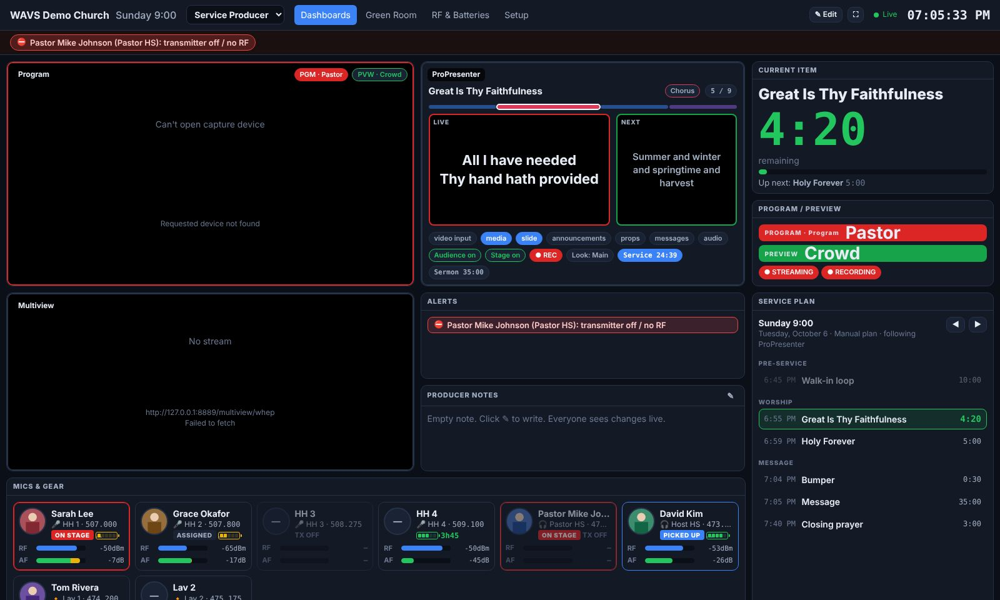
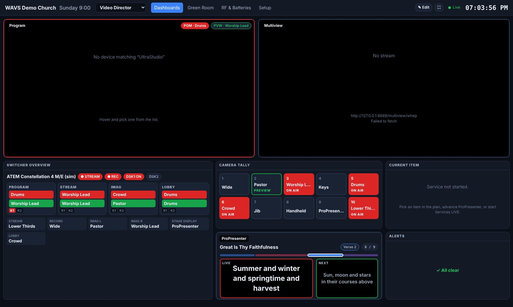
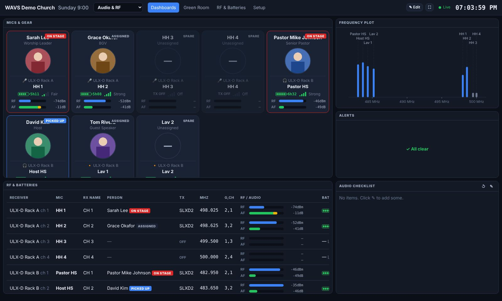
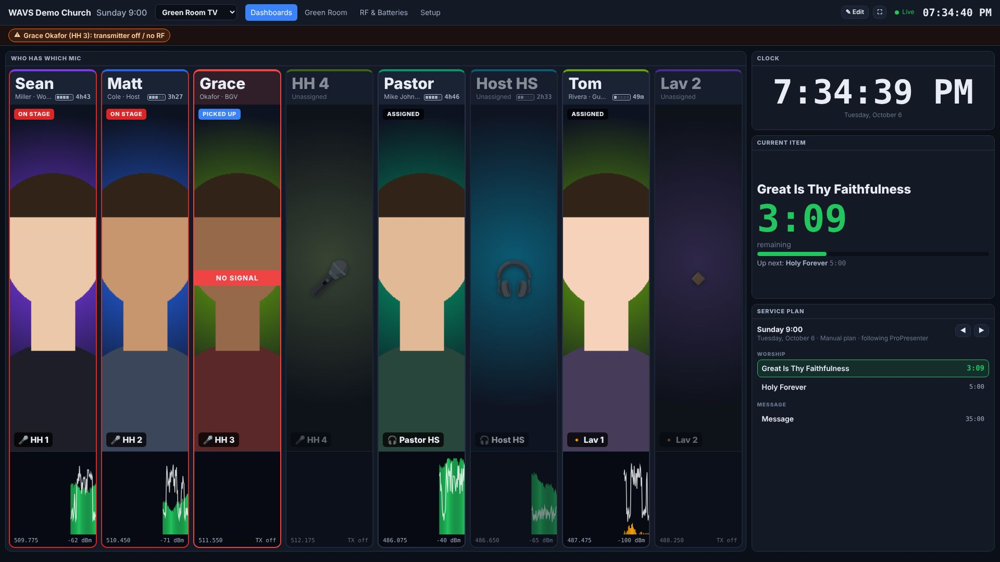
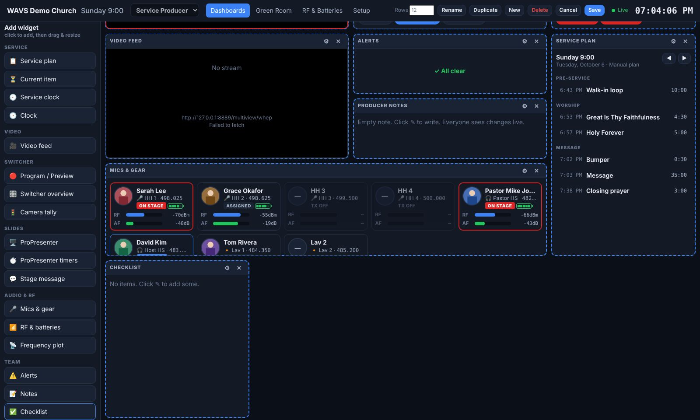

# WAVS Dashboard

A self-hosted production dashboard for live events and church services. It runs on one
computer in the booth, and any browser on the network can open it: FOH, broadcast, the
green room tablet, a TV in the hallway, or a phone.

You build **your own dashboards**: one per role or screen, made of widgets you drag and resize.
The widgets include video feeds, ProPresenter, ATEM tally, the Planning Center service plan,
wireless mics with photos, RF, notes and checklists.



| | |
|---|---|
|  |  |
|  |  |

<sub>Screenshots taken with `npm run demo`, using simulated devices and placeholder photos.</sub>

## Quick start

```bash
npm install
npm run demo          # every device simulated, no hardware needed
# open http://localhost:8080
```

To use your own gear:

```bash
cp config/config.example.yaml config/config.yaml
# edit IPs, mic labels, video sources, Planning Center token…
npm start
```

## Pages

| URL | What it is |
|---|---|
| `/` or `/d/<name>` | **Dashboards.** Pick one from the drop-down in the header. Each screen remembers the last one it showed. |
| `/greenroom` | The **mic board**: one tall column per mic with the person's name, photo, battery and a live RF/audio graph, plus **Picked up / On stage / Returned** buttons (`?handoff=1` keeps them on, `?view=cards` for the older card view). |
| `/rf` | Every receiver channel, plus a frequency plot that flags carriers spaced too closely. |
| `/admin` | **Setup**: service plan (Planning Center or typed in), people and photos, mic assignments. |

Add `?kiosk=1` to any URL to hide the header on TVs and confidence monitors. The ⛶ button does
the same.

## Building dashboards

Four starter dashboards are created on first run: **Service Producer**, **Video Director**,
**Audio & RF** and **Green Room TV**. To change one, or make your own:

1. Click **✎ Edit**. The widget panel opens on the left.
2. Click a widget to add it, drag it by its title bar, and resize it from the corner.
3. Use ⚙ for a widget's settings: which video source, switcher and M/E, which mics, which
   checklist, and so on. ✕ removes it.
4. **Rows** sets how many rows fit on one screen without scrolling. Use fewer rows for big TVs
   and more for desktops.
5. **Save**. Every screen showing that dashboard updates straight away.

**New** and **Duplicate** create dashboards for other roles, such as Camera Ops, Lighting,
Lobby TV or Campus 2. On phones, widgets stack into a single column.

### Widgets

| Category | Widgets |
|---|---|
| Service | **Service plan** (planned start times, current item countdown, actual vs planned), **Current item** (big countdown and up next), **Service clock** (countdown to start, time remaining, overrun), **Clock** |
| Video | **Video feed** (capture card, WebRTC/WHEP, HLS, MJPEG, web page) with PGM/PVW tally overlay |
| Switcher | **Program / Preview** for any M/E, **Switcher overview** (every M/E with keyers, DSKs, aux outputs, stream/record), **Camera tally** (red on air, green preview, per M/E or all) |
| Slides | **ProPresenter** (live and next slide, groups, layers, screens, look, recording), **ProPresenter timers**, **Stage message** |
| Audio & RF | **Mics & gear** (board of tall photo columns with a 40-second RF/audio graph, photo cards, or compact strip), **RF & batteries** table, **Frequency plot** |
| Team | **Alerts**, **Notes** (shared live), **Checklist** (shared live, with sections and progress), **Text**, **Web page** (stream analytics, Resi, encoder status, Companion…) |

### Mic board
The **Green Room TV** dashboard and `/greenroom` show one column per mic:
- **Who:** the person's first name in large type, then their surname and role, with their photo
  on a coloured glow. You can pick each person's colour on the Setup page (🎨 next to their photo),
  otherwise one is picked automatically.
- **Which mic:** the mic label and its status (Assigned, Picked up, On stage).
- **Health:** battery in the corner, plus a rolling graph across the bottom. The bars are RF
  signal (green, or amber when weak) and the white line is audio, so you can see who's talking.
- **Problems:** the whole column turns red and pulses if a mic in use loses signal or its receiver
  goes offline.

Cut-out photos (PNG with a transparent background) look best, because the colour shows around them.

Notes and checklists are shared by name. Two widgets set to the same name, even on different
dashboards, show and edit the same note.

## Service plan and auto-tracking

### Planning Center Services
1. Create a **Personal Access Token** at
   <https://api.planningcenteronline.com/oauth/applications>.
2. Add it to `config/config.yaml`:
   ```yaml
   planningCenter:
     appId: "…"
     secret: "…"
     serviceTypes: []      # optional: only these service type IDs
   ```
   You can use the `PCO_APP_ID` and `PCO_SECRET` environment variables instead.
3. Restart. The next upcoming plan is loaded automatically, and the **Setup** page lists upcoming
   plans across your service types so you can switch.

The plan gives you items (songs with keys, headers, lengths), service times, and the current item.

### Which item is "current"
Whichever of these happens most recently moves the plan along:
- **ProPresenter**: the operator brings up a song or presentation whose name matches a plan item.
  For example, "Holy Forever" matches "Holy Forever (Live)". So running ProPresenter as usual
  tracks the service. Set `service.followProPresenter: false` to turn this off.
- **Planning Center Services LIVE**: if someone is advancing LIVE, the dashboard follows it.
- **Manual**: tap an item in the Service plan widget, or use ◀ ▶.

When an item ends, the time it actually took is recorded, so the plan shows actual against
planned (red if it ran long). That's your "how did Sunday go".

### Faith Teams and other sources
Faith Teams' public API covers people and giving, but not service plans. Until it does, use
**Type or paste a plan** on the Setup page:

```
# Worship
song 4:30 Goodness Of God
song 5:00 Holy Forever
# Message
0:30 Bumper
35m Message
```

Set a start time to get planned item times and the service clock. Everything else, including
ProPresenter auto-tracking, works the same as with Planning Center.

## Hardware

### Shure SLX-D (also ULX-D, QLX-D, Axient Digital)
Connects to each receiver's control port (TCP 2202). The product family is detected from the
receiver, or you can set `model: SLXD4D`. For SLX-D it reads:
- channel name, frequency and group/channel
- transmitter model (SLXD1/SLXD2), and whether the transmitter is on
- battery bars and runtime in minutes (`TX_BATT_BARS`, `TX_BATT_MINS`)
- live RF level and audio peak/RMS meters (on SLX-D's 0–120 scale)

With `control.pushNamesToReceivers: true`, assigning a person writes their first name to the
receiver's display.

> Receivers allow a limited number of control connections, and Wireless Workbench uses them too.
> If one won't connect, close other control software.

### Blackmagic ATEM, including Constellation 4 M/E
Uses `atem-connection`, which installs automatically. It reports every M/E (program, preview,
transition, fade to black, upstream keyers), the downstream keyers, every aux output, camera input
names, and streaming/recording state. Use `meNames` and `auxNames` in the config for friendly
labels, and `me:` for the default M/E. Each widget can pick its own M/E.

vMix is supported through its HTTP API.

### ProPresenter 7 (7.9 or newer)
In ProPresenter, go to **Settings → Network → Enable Network** and put the port in the config.
More than one machine is supported. Sending stage messages from the dashboard is optional
(`control.propresenterStageMessage`).

### Video feeds
A web page can't read SDI or NDI directly. Each source in `video.sources` uses one of these types:

| Type | Use when | Notes |
|---|---|---|
| `capture` | A capture card (UltraStudio, DeckLink, Magewell, Cam Link…) is connected to the computer showing the dashboard | Lowest latency. Only works on `http://localhost` or HTTPS. Hover over the tile to pick a device. |
| `webrtc` | You want feeds on any screen in the building | Run [MediaMTX](https://github.com/bluenviron/mediamtx) and send it SRT or RTMP from the ATEM or an encoder (or NDI through a bridge). URL: `http://<mediamtx>:8889/<path>/whep`. About 0.5 s latency. |
| `hls` | Latency doesn't matter | Any `.m3u8` URL |
| `mjpeg` | A camera or encoder serves MJPEG or JPEG snapshots | Add `refreshMs` for snapshot URLs |
| `iframe` | Any web page | |

## Alerts
These alerts appear on every page, and critical ones play a chime:
- a receiver, ProPresenter or switcher goes offline
- a transmitter is **off or has no RF while its person is marked "On stage"** (critical) or
  "Picked up"
- a battery is low (runtime is used when the transmitter reports it)
- weak RF on a mic in use, RF interference, a muted transmitter on stage, or Fade to Black left on

You can change the thresholds under `alerts:` in the config.

## Tailoring it
- **Branding**: `org.name`, `org.logo` and `org.theme` (colours). All styling is in `public/css/app.css`.
- **Security**: set `security.adminPin` to require a PIN for setup and dashboard edits. Moving
  through the plan, notes and checklists stay open so the whole team can use them.
- **New widget**: add an entry to `public/js/widgets.js`. Each widget declares its title, settings
  and a `mount()` function, and it then appears in the builder automatically.
- **New hardware**: add a driver in `server/drivers/` that calls `hub.update(section, id, data)`,
  and register it at the top of `server/index.js`. Good candidates: Sennheiser (SSC),
  Allen & Heath and Behringer/Midas consoles, Companion variables, YouTube/Facebook viewer counts.

## Architecture

```
 ProPresenter ──HTTP──┐
 ATEM / vMix ─────────┤                       ┌── /d/<dashboard>  widgets (gridstack)
 Shure RX ──TCP 2202──┼─► Node server ──WS────┼── /greenroom
 Planning Center ─────┤   (hub, alerts,       ├── /rf
 (simulators) ────────┘    service tracker)   └── /admin  (setup)
                          data/*.json  (people, plan progress, notes, dashboards)
 Capture card / MediaMTX ──────────────────► browser <video>
```

- `server/`: Express and WebSocket. All live state sits in one hub. Meters are batched and sent
  10 times per second.
- `public/`: plain HTML, CSS and JS modules with no build step.
- `data/`: everything you create (people, photos, dashboards, notes, plan progress) as plain JSON.
  Back this folder up.
- `npm test`: tests for the Shure (SLX-D/ULX-D/AD) and vMix parsers, alert rules, plan parsing
  and auto-tracking.

## Running it permanently

Any Mac, Windows or Linux computer with Node.js 18 or newer will work. To keep it running after
a reboot, use `pm2` (`npm i -g pm2 && pm2 start server/index.js --name wavs && pm2 save && pm2
startup`), or a systemd service, or a launchd agent. Give the computer a fixed IP so the
dashboard URL doesn't change.
